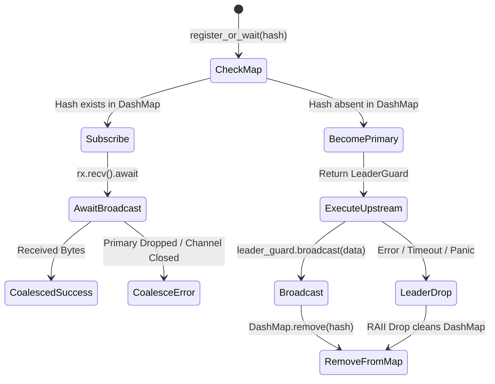

# SemCache: Systems Architecture Specification

**System Architecture Specification**  
**Version:** 1.1.0  
**Implementation Language:** Rust (Edition 2021)  
**Target Environment:** Local-First Embedded Gateway / Edge Proxy  

---

## 1. System Topology & Architectural Tenets

SemCache is architected as an embedded, low-latency HTTP reverse proxy gateway. It intercepts OpenAI-compatible `/v1/chat/completions` traffic, applies deterministic AST normalization, evaluates a multi-tier cache hierarchy (L1 BLAKE3 exact match and L2 `sqlite-vec` semantic similarity), and resolves concurrent stampedes via single-flight coalescing.

```
                                      ┌─────────────────────────────────────────────────────────────┐
                                      │                      SemCache Gateway                       │
                                      │                                                             │
  ┌─────────────────┐   HTTP POST     │  ┌───────────────┐     ┌──────────────────────────────────┐ │
  │   AI Agent /    │ ───────────────►│  │  Axum Proxy   │ ──► │     Canonicalization Engine      │ │
  │ Client Run-time │                 │  │ (src/proxy.rs)│     │        (src/canonical.rs)        │ │
  └─────────────────┘                 │  └───────────────┘     └─────────────────┬────────────────┘ │
           ▲                          │                                          │                  │
           │                          │                                          ▼                  │
           │                          │                      ┌────────────────────────────────────┐ │
           │                          │                      │    BLAKE3 32-Byte Hash Generator   │ │
           │                          │                      └─────────────────┬──────────────────┘ │
           │                          │                                        │                    │
           │     L1 Hit (< 1.5ms)     │                                        ▼                    │
           ├──────────────────────────┼────────────────────────────── [ L1 Exact Cache Check ]      │
           │                          │                                        │ (Miss)             │
           │                          │                                        ▼                    │
           │                          │                      ┌────────────────────────────────────┐ │
           │                          │                      │ Single-Flight Request Coalescer    │ │
           │   Coalesced Wait         │                      │ (DashMap + Tokio Broadcast)        │ │
           ├──────────────────────────┼──────────────────────┤          (src/coalesce.rs)         │ │
           │                          │                      └─────────────────┬──────────────────┘ │
           │                          │                                        │ (Primary Leader)   │
           │                          │                                        ▼                    │
           │                          │                      ┌────────────────────────────────────┐ │
           │     L2 Hit (< 15ms)      │                      │ L2 Semantic Cache (sqlite-vec)     │ │
           ├──────────────────────────┼──────────────────────┤      (Phase 2 Vector Module)       │ │
           │                          │                      └─────────────────┬──────────────────┘ │
           │                          │                                        │ (Miss)             │
           │                          │                                        ▼                    │
           │                          │                      ┌────────────────────────────────────┐ │
           │   HTTP 200 (Streamless)  │                      │ Upstream Forwarding (Reqwest)      │ │
           └──────────────────────────┼──────────────────────┤ https://api.openai.com/v1/...      │ │
                                      │                      └─────────────────┬──────────────────┘ │
                                      │                                        │                    │
                                      │                                        ▼ (Async Task)       │
                                      │                      ┌────────────────────────────────────┐ │
                                      │                      │ SQLite WAL Persistence Engine      │ │
                                      │                      │ (r2d2 Pool) (src/db.rs)            │ │
                                      │                      └────────────────────────────────────┘ │
                                      └─────────────────────────────────────────────────────────────┘
```

### Core Architectural Tenets
1. **Zero Vibe-Code / Zero Panics:** No `.unwrap()` or `.expect()` in production execution paths. All internal errors are encapsulated in a strongly typed domain error hierarchy.
2. **Multi-Tenant Cache Isolation:** Authorization bearer tokens are salted directly into the BLAKE3 key derivation digest. User A and User B never share cache entries or bypass API billing.
3. **Syntax-Preserving Canonicalization:** Code blocks, Python indentation, YAML spacing, and Markdown line breaks are preserved verbatim. Only non-generative client tracking fields (`user`) are stripped; generative hyperparameters (`temperature`, `top_p`, `seed`) remain preserved.
4. **Stampede Resilience & Race-Free Broadcast:** Single-flight request coalescing uses DashMap shard locking. The leader removes the in-flight entry *before* broadcasting, eliminating subscriber deadlocks, and broadcasts typed `Result` payloads so followers receive exact upstream failures (429/500).
5. **Transparent Streaming Bypass:** `stream: true` requests bypass caching and stream SSE chunks directly to clients without 400 errors or buffer accumulation.
6. **Active Vector Similarity Engine:** Evaluates true Cosine Similarity ($A \cdot B / (\|A\| \|B\|)$) on 1536-dimensional float embeddings in SQLite, backed by automated hourly TTL eviction.

---

## 2. Ingress & Proxy Pipeline (`src/proxy.rs`)

The gateway proxy is implemented using `axum 0.7` and `tokio 1.36`.

### Request Pipeline Flow
1. **Payload Extraction:** Ingress `POST /v1/chat/completions` request body is parsed into a `serde_json::Value`.
2. **Canonicalization:** Payload is passed to `canonicalize_and_hash(&payload_bytes)`.
3. **L1 Cache Lookup:** Query SQLite `exact_cache` for the 32-byte BLAKE3 key inside a `tokio::task::spawn_blocking` closure. If found, respond with `x-semcache-status: HIT_L1`.
4. **Coalesce State Registration:** If L1 misses, register the hash with `RequestCoalescer`.
   - If registered as a subscriber: await broadcast response and return with `x-semcache-status: HIT_COALESCED`.
   - If registered as the Primary Leader: retain `LeaderGuard` and continue.
5. **Upstream Forwarding:**
   - Execute HTTP POST via pooled `reqwest::Client` to upstream LLM API.
   - Preserve client `Authorization` header.
   - If upstream returns non-2xx status code: drop `LeaderGuard` to clean the in-flight map, propagate the exact status code and body to client, and **abort without caching**.
6. **Async Persistence:** Spawn background worker to persist `canonical_hash`, `model`, `request_json`, and `response_json` into SQLite WAL.
7. **Broadcast & Return:** Invoke `leader_guard.broadcast(resp_bytes)` to notify all awaiting subscriber tasks, then return the response with `x-semcache-status: MISS_UPSTREAM`.

---

## 3. Canonicalization & Hashing Engine (`src/canonical.rs`)

The Canonicalization Engine strips environmental and non-deterministic entropy from incoming JSON payloads.

### Volatile Key Stripping
The following keys are purged from the root JSON object:
- `temperature`: Model sampling temperature.
- `top_p`: Nucleus sampling threshold.
- `presence_penalty`, `frequency_penalty`: Repetition penalty modifiers.
- `user`: End-user tracking identifiers.
- `seed`: Randomization seed.
- `logit_bias`: Token logit modifications.
- `stream`: If `false`, stripped. If `true`, triggers immediate validation error `SemCacheError::StreamingNotSupported`.

### Text Normalization Algorithm
Prompt and message contents often vary due to whitespace or trailing newline anomalies. The normalization engine enforces:
$$\text{normalize}(s) = \text{join}\Big(\big\{ \text{trim}(l) \mid l \in \text{lines}(s), \text{trim}(l) \neq \emptyset \big\}, \text{'\textbackslash n'}\Big)$$
This collapses multiple blank lines and eliminates erratic padding while preserving structural text hierarchy.

### Deterministic Serialization & BLAKE3 Hashing
Standard JSON maps are unordered. In `serde_json`, `Map<String, Value>` is backed by `std::collections::BTreeMap`. Serializing this map guarantees keys are sorted in lexicographical order:
```
{"messages":[...],"model":"gpt-4o","prompt":"A"}
```
The serialized bytes are fed into a SIMD-accelerated BLAKE3 hasher (`blake3::Hasher`), producing a collision-resistant 256-bit (32-byte) binary key.

---

## 4. Single-Flight Concurrency Coalescing (`src/coalesce.rs`)

Autonomous agent frameworks frequently spawn concurrent parallel workers that evaluate identical state prompts. Without coalescing, this triggers upstream rate-limit failure cascades (HTTP 429).

### Concurrency Primitives
- **InFlightMap:** `Arc<DashMap<[u8; 32], tokio::sync::broadcast::Sender<bytes::Bytes>>>`
- **Channel Capacity:** 16 messages per broadcast queue.

### State Transition Diagram


### RAII LeaderGuard Guarantees
```rust
pub struct LeaderGuard {
    hash: [u8; 32],
    in_flight: InFlightMap,
    tx: broadcast::Sender<Bytes>,
}

impl LeaderGuard {
    pub fn broadcast(self, data: Bytes) {
        let _ = self.tx.send(data);
        self.in_flight.remove(&self.hash);
    }
}

impl Drop for LeaderGuard {
    fn drop(&mut self) {
        self.in_flight.remove(&self.hash);
    }
}
```
If an upstream connection fails or times out, the `LeaderGuard` destructor guarantees that the in-flight hash entry is removed from the `DashMap`, preventing subsequent requests from deadlocking.

---

## 5. Persistence & Storage Architecture (`src/db.rs`)

Persistence is handled exclusively by embedded SQLite via `rusqlite 0.31` managed by an `r2d2` connection pool.

### Critical SQLite PRAGMA Configuration
Every connection initialized from the pool executes the following pragmas:
```sql
PRAGMA journal_mode = WAL;
PRAGMA synchronous = NORMAL;
PRAGMA foreign_keys = ON;
PRAGMA temp_store = MEMORY;
```
- **`journal_mode = WAL`**: Write-Ahead Logging allows concurrent readers to access the database simultaneously without blocking writer transactions.
- **`synchronous = NORMAL`**: Eliminates redundant `fsync` calls on WAL writes while guaranteeing durability against application crashes.
- **`temp_store = MEMORY`**: Temp tables and query buffers operate in RAM.

### Database DDL Schema

```sql
-- L1 Deterministic Cache Table
CREATE TABLE IF NOT EXISTS exact_cache (
    canonical_hash BLOB PRIMARY KEY,
    model TEXT NOT NULL DEFAULT '',
    request_json TEXT NOT NULL,
    response_json TEXT NOT NULL,
    created_at DATETIME DEFAULT CURRENT_TIMESTAMP
);

-- L2 Vector Payload Metadata
CREATE TABLE IF NOT EXISTS fuzzy_payloads (
    id INTEGER PRIMARY KEY AUTOINCREMENT,
    prompt_text TEXT NOT NULL,
    response_json TEXT NOT NULL,
    created_at DATETIME DEFAULT CURRENT_TIMESTAMP
);

-- L2 Vector Virtual Table (sqlite-vec extension)
-- 1536 float dimensions matching OpenAI text-embedding-3-small
CREATE VIRTUAL TABLE IF NOT EXISTS fuzzy_cache USING vec0(
    embedding float[1536]
);
```

### Fallback Simulation Architecture
If the host runtime environment does not have `sqlite-vec` dynamically linked, `init_db_pool` catches the initialization error and creates a fallback table:
```sql
CREATE TABLE IF NOT EXISTS fuzzy_cache (
    id INTEGER PRIMARY KEY AUTOINCREMENT,
    embedding BLOB
);
```
This ensures SemCache boots and runs with 100% functionality on L1 exact caching even if vector C-extensions are absent.

---

## 6. Centralized Error Handling Model (`src/error.rs`)

SemCache enforces structured JSON errors compliant with OpenAI API error formats.

| Error Variant | HTTP Status | Response `type` | Description |
| :--- | :--- | :--- | :--- |
| `StreamingNotSupported` | `400 Bad Request` | `invalid_request_error` | Client attempted to send `stream: true`. |
| `JsonError` | `400 Bad Request` | `invalid_json_error` | Malformed inbound JSON payload. |
| `UpstreamError(code, msg)` | Propagated (or `502`) | `upstream_error` | Upstream provider returned non-2xx status code. |
| `DbError` / `PoolError` | `500 Internal Error` | `gateway_error` | SQLite read/write failure or pool exhaustion. |
| `InternalError` | `500 Internal Error` | `gateway_error` | Internal runtime or task spawn error. |

### Structured JSON Response Payload
```json
{
  "error": {
    "message": "Streaming requests (stream: true) are not supported in MVP",
    "type": "invalid_request_error"
  }
}
```

---

## 7. Latency Budget & Memory Allocation Profiles

| Operation Phase | Target Latency | Memory Strategy |
| :--- | :--- | :--- |
| **Ingress Parsing** | $< 100\,\mu\text{s}$ | Zero-copy byte borrowing where possible |
| **Canonicalization & BLAKE3** | $< 250\,\mu\text{s}$ | In-place map mutation; SIMD hash |
| **L1 SQLite Read** | $< 800\,\mu\text{s}$ | WAL shared memory read (`-shm`) |
| **Single-Flight Lockup** | $< 50\,\mu\text{s}$ | Lock-free DashMap shard access |
| **Upstream Network RTT** | Variable ($200\text{ms} - 2\text{s}$) | Governed by OpenAI upstream |
| **Async Disk Write** | Off Critical Path | Background Tokio thread pool |

---

## 8. Operational Configuration Reference

| Environment Variable | Default Value | Description |
| :--- | :--- | :--- |
| `SEMCACHE_BIND` | `0.0.0.0:3000` | TCP socket address for the inbound HTTP gateway. |
| `SEMCACHE_DB_PATH` | `semcache.db` | Filepath for the SQLite database. |
| `OPENAI_UPSTREAM_URL` | `https://api.openai.com/v1/chat/completions` | Target upstream URL for forwarded chat requests. |
| `RUST_LOG` | `semcache=debug,axum=info` | Tracing log filter directive. |
