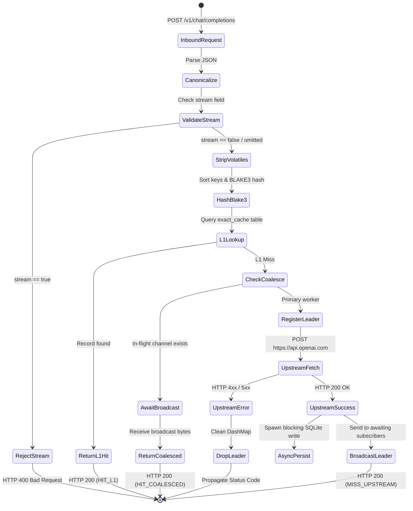

# SemCache: Product Requirements Document (PRD)

**Document Version:** 1.1.0  
**Status:** Approved & Implemented  
**Target Release:** SemCache v0.1.0-alpha  
**Author:** Principal Systems Architect  

---

## 1. Executive Summary & Problem Space

### 1.1 The Agentic Explosion & API Cost Trajectory
Autonomous AI agents, coding assistants, and multi-agent coordination loops execute non-deterministic search graphs, test-and-repair iterations, and automated tool calls. In practice, these workloads exhibit high semantic repetition:
- Agent retry loops dispatch near-identical prompts with slight temperature or formatting variations.
- Concurrent sub-agents in tree-of-thought or tournament architectures query identical foundational contexts simultaneously.
- Standard HTTP reverse proxies fail to cache these requests because LLM client SDKs inject non-semantic hyperparameters (`temperature`, `top_p`, `user`, `seed`) into the request body, and prompt strings often contain insignificant whitespace variance.

### 1.2 The Solution: SemCache
**SemCache** is an embedded, local-first HTTP proxy gateway designed to sit transparently between client AI applications and OpenAI-compatible LLM endpoints. It delivers cost reduction, latency optimization, and rate-limit preservation through:
1. **Deterministic Request Canonicalization:** Stripping non-semantic entropy and normalizing text.
2. **L1 Deterministic Exact-Match Cache:** Sub-millisecond retrieval via SIMD-accelerated BLAKE3 hashing.
3. **L2 Semantic Vector Cache:** Vector-similarity lookup via embedded `sqlite-vec` (Cosine similarity $\ge 0.92$).
4. **Single-Flight Request Coalescing:** Consolidating concurrent duplicate requests into a single upstream call.

```
[ AI Agent / Client ] 
        │ (POST /v1/chat/completions)
        ▼
[ SemCache Gateway (Port 3000) ]
        ├── 1. Canonicalize & Strip Hyperparameters
        ├── 2. BLAKE3 Hashing
        ├── 3. L1 Exact Match (SQLite WAL) ────────► [ Cache Hit: < 1.5ms ]
        ├── 4. Single-Flight Coalesce (DashMap) ───► [ Concurrent Wait: 0 Upstream Tokens ]
        ├── 5. L2 Vector Search (sqlite-vec) ─────► [ Semantic Hit: < 15ms ]
        └── 6. Upstream Forwarding ───────────────► [ OpenAI / vLLM / Ollama ]
```

---

## 2. Personas & Target Users

| Persona | Environment | Primary Pain Point | Core Need |
| :--- | :--- | :--- | :--- |
| **Autonomous Agent Developer** | Local workstations, containerized loops | Cost explosion during recursive self-healing or multi-agent swarms. | Transparent drop-in proxy with zero cloud infrastructure overhead. |
| **AI Infrastructure Engineer** | CI/CD test runners, development sandboxes | Upstream rate-limit exhaustion (HTTP 429) on automated integration tests. | Single-flight coalescing and high-throughput local caching. |
| **Local LLM Operator** | Edge servers running Ollama/vLLM | Redundant GPU compute wasted on re-evaluating prompt prefixes. | Deterministic offloading of prompt evaluations. |

---

## 3. Core Functional Requirements (FR)

### FR-01: OpenAI-Compatible Ingress Proxy
- The gateway must bind to `0.0.0.0:3000` (configurable via `SEMCACHE_BIND`).
- Must expose an OpenAI-compatible endpoint: `POST /v1/chat/completions`.
- Must preserve incoming HTTP `Authorization` bearer tokens and pass them upstream.

### FR-02: Request Canonicalization Engine
- The gateway must parse incoming JSON payloads and strip volatile hyperparameters that do not alter the semantic question:
  - `temperature`
  - `top_p`
  - `presence_penalty`
  - `frequency_penalty`
  - `user`
  - `seed`
  - `logit_bias`
- If `stream: false` is present, it must be stripped to prevent cache divergence from omitted keys.
- **Message Content Normalization:**
  - Content strings in the `messages` array must be trimmed of leading and trailing whitespace.
  - Consecutive newlines must be collapsed into a single newline boundary.
- **Deterministic Serialization:** JSON keys must be serialized in strictly sorted lexicographical order prior to hashing.

### FR-03: Streaming Request Rejection (MVP Scope)
- If an incoming payload contains `stream: true`, the gateway must reject the request with HTTP 400 Bad Request and error code `StreamingNotSupported`.
- *Rationale:* Unary JSON caching is prioritized for the deterministic MVP. Streaming response chunk aggregation is scheduled for Phase 3.

### FR-04: L1 Exact-Match Deterministic Caching
- Compute a 32-byte BLAKE3 hash over the canonicalized JSON bytes.
- Query the SQLite `exact_cache` table by `canonical_hash`.
- If a match exists:
  - Return the cached response immediately with HTTP status 200.
  - Inject the custom HTTP header: `x-semcache-status: HIT_L1`.
  - Content-Type must be `application/json`.

### FR-05: Single-Flight Request Coalescing
- When an L1 cache miss occurs, the gateway must check an in-memory `DashMap` for concurrent in-flight requests matching the same BLAKE3 hash.
- **If an in-flight request exists:** The worker subscribes to a `tokio::sync::broadcast` channel and asynchronously awaits the leader's response. On receipt, it returns the payload with header `x-semcache-status: HIT_COALESCED`.
- **If no in-flight request exists:** The worker becomes the Primary Leader, registers a broadcast channel in the map, proceeds to upstream execution, and broadcasts the completed payload to all waiting clients upon arrival.
- **Guaranteed Cleanup:** If the Primary Leader encounters an error or drops unexpectedly, RAII guards must ensure the hash is purged from the `DashMap` to prevent subscriber deadlocks.

### FR-06: L2 Semantic Vector-Similarity Caching (Phase 2 Integration)
- If L1 exact match misses, generate an embedding vector for the prompt text (default: 1536-dimensional float vector matching `text-embedding-3-small`).
- Query the virtual table `fuzzy_cache` using `sqlite-vec`.
- Evaluate Cosine distance: if $\text{distance} \le 0.08$ (Cosine similarity $\ge 0.92$), return the cached response with `x-semcache-status: HIT_L2`.
- In MVP release, `init_db_pool` executes a graceful fallback simulation if the `sqlite-vec` dynamic extension is not linked in the local host environment.

### FR-07: Upstream Forwarding & Non-Cacheable Failure Handling
- When a request misses all cache layers, forward the payload to the configured upstream endpoint (default: `https://api.openai.com/v1/chat/completions`).
- **Error Propagation:** If upstream returns a non-2xx status code (e.g., 429 Too Many Requests, 500 Server Error):
  - The error payload and status code must be returned to the client immediately.
  - The error response **MUST NOT** be persisted into the cache.

### FR-08: Asynchronous Persistence Layer
- Upon receiving a successful 2xx response from upstream:
  - Dispatch the HTTP response bytes to the client immediately.
  - Asynchronously persist the `canonical_hash`, `model`, `request_json`, and `response_json` into SQLite using `tokio::task::spawn_blocking`.
  - Disk I/O must never block the client latency path.

---

## 4. Non-Functional Requirements (NFR)

| ID | Category | Requirement Specification |
| :--- | :--- | :--- |
| **NFR-01** | **Latency SLA** | L1 cache hits must return with P99 latency $< 1.5\text{ms}$. L2 vector hits must return with P95 latency $< 15\text{ms}$. |
| **NFR-02** | **Memory Safety** | Zero `.unwrap()`, `.expect()`, or explicit panics in production request paths. Memory leaks strictly prevented by RAII guards. |
| **NFR-03** | **Storage Engine** | Embedded SQLite with Write-Ahead Logging (`PRAGMA journal_mode = WAL; PRAGMA synchronous = NORMAL; PRAGMA foreign_keys = ON;`). Zero external DBMS dependencies. |
| **NFR-04** | **Concurrency** | The gateway must sustain a minimum of 5,000 concurrent client connections without connection pool exhaustion or socket starvation. |
| **NFR-05** | **Zero Allocation** | Critical hot paths must utilize zero-copy `bytes::Bytes` slicing to minimize heap allocations during HTTP and disk shuttling. |
| **NFR-06** | **Telemetry** | Every response must include diagnostic headers (`x-semcache-status`) and emit structured logs via `tracing`. |

---

## 5. System State Machine & Request Lifecycle



---

## 6. Release Roadmap

- **Phase 1 (MVP - Completed):**
  - Axum HTTP gateway engine.
  - Canonicalization and volatile stripping.
  - BLAKE3 L1 deterministic caching.
  - SQLite WAL persistence and schema migrations.
  - Single-flight concurrency coalescing.
- **Phase 2 (Semantic Vector Expansion):**
  - Native runtime linking of `sqlite-vec`.
  - Local embedding generation via `fastembed-rs` (ONNX runtime) to eliminate external embedding API latency.
  - Automated threshold calibration for Cosine distance metrics.
- **Phase 3 (Streaming Interception):**
  - Server-Sent Events (SSE) parser and chunk aggregator.
  - Stream reconstruction for deterministic caching of streamed completions.
- **Phase 4 (Enterprise Observability):**
  - Prometheus metrics exporter (`/metrics`).
  - Web-based administrative cache inspection dashboard.
